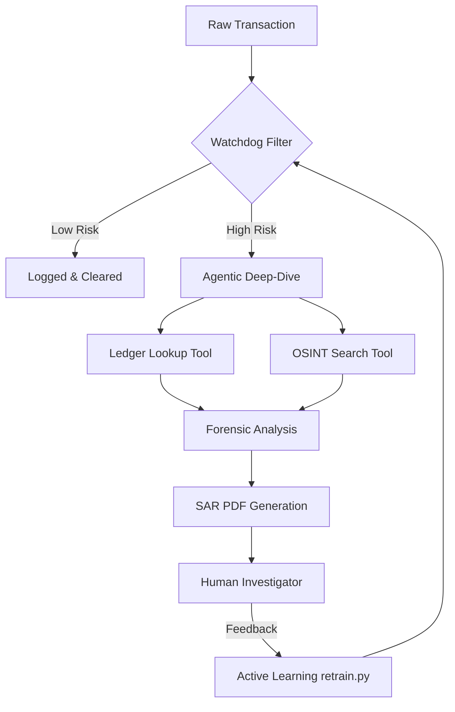

# AML Intelligence: Autonomous Financial Surveillance 

A multi-stage Anti-Money Laundering (AML) platform that moves beyond static rules to proactive, agentic investigation. This system combines high-throughput GBDT models with LLM-powered forensic reasoning to detect, investigate, and report suspicious financial activity.

---

## The Problem: Traditional AML is Broken
Legacy Anti-Money Laundering systems in banks suffer from three critical failures:
1.  **Alert Fatigue**: 95-98% of system-generated alerts are "False Positives," wasting thousands of investigator hours.
2.  **The Black Box**: Linear models can't explain *why* they flagged a transaction, making it impossible to defend in court.
3.  **Information Silos**: Transaction models don't have access to the web or behavioral history, leading to context-blind decisions.

##  Capabilities: How This Hub Fixes It
*   **Contextual Reasoning**: Uses an LLM Agent to "read" the ledger and the web, just like a human forensic expert.
*   **Automatic Exoneration**: Explicitly designed to find reasons to *disprove* suspicion, slashing the false positive rate.
*   **Audit-Ready Output**: Automatically generates regulatory-compliant SAR reports with full evidence narratives.
*   **Self-Healing Model**: A feedback loop where human expertise directly retrains the machine learning layer.

---

## The Multi-Stage Architecture

### Phase 1: The Watchdog (Detection)
A high-performance **CatBoost** model trained on the synthetic `SAML-D` dataset. It processes transaction sequences in real-time, focusing on behavioral anomalies rather than just static amounts. 
*   **Key Metrics**: Optimized for PR-AUC to handle extreme class imbalance.
*   **Explainability**: Integrated SHAP values provide "Risk Drivers" for every alert.

---

## Data & Model Intelligence

### The SAML-D Dataset
The system leverages the **SAML-D (Synthetic Anti-Money Laundering Dataset)**, a peer-reviewed dataset designed to overcome the "data scarcity" and "label quality" issues in financial forensics.

*   **Scale**: 9,504,852 transactions across 12 distinct behavioral features.
*   **Complexity**: Incorporate 28 typologies (11 normal, 17 suspicious) and 15 graphical network structures to simulate sophisticated laundering flows.
*   **Realism**: An extreme class imbalance of **0.1039% suspicious transactions**, perfectly mimicking the "needle in a haystack" challenge in global banking.

**Core Data Features**:
*   **Temporal Tracking**: Chronological Time and Date stamps.
*   **Account Graph**: Detailed Sender/Receiver metadata for network link analysis.
*   **Transaction DNA**: Amount, Payment Type (Cash, Cross-border, ACH, etc.), and Bank Locations.
*   **High-Risk Logic**: Targeted geographical features (Mexico, Turkey, UAE, etc.) and currency mismatches.

### Why CatBoost?
For this project, CatBoost was chosen as the core GBDT engine over XGBoost/LightGBM for three primary reasons:
1.  **Native Categorical Support**: Financial data is heavy on categories (Bank Locations, Payment Types). CatBoost handles these without needing manual One-Hot Encoding, preventing feature-space explosion.
2.  **Symmetric Trees**: Provides faster inference and better generalization, which is crucial for high-throughput banking systems.
3.  **Stability with Imbalance**: The model's built-in handling of weights allowed us to achieve higher **PR-AUC (Precision-Recall)**, which is the industry standard for imbalanced AML data.

---
### Phase 2: The Detective (Investigation)
When the Watchdog flags a transaction, an autonomous **LangGraph Agent (Llama 3.3-70B)** is triggered. It has access to:
*   **Internal Ledger**: Aggregates account history to find "User Baselines."
*   **OSINT Search**: Uses Tavily to check for PEP/Sanctions news on account holders.
*   **Forensic Logic**: Programmed with "Exoneration Logic" to actively disprove false positives.

### Phase 3: The Reporter (Compliance)
The Agent generates a professional, legal-grade **PDF Suspicious Activity Report (SAR)**. This report includes the evidence narrative, forensic summary, and a regulatory risk verdict.

### Phase 4: The Flywheel (Continuous Learning)
Human investigator feedback is used to retrain the Watchdog. The system uses a **Champion vs. Challenger** deployment strategy—the model only updates if the new version is statistically superior to the current one.

---

## Tech Stack
*   **Backend**: FastAPI (Python)
*   **Frontend**: Streamlit (Command Center Dashboard)
*   **ML Engine**: CatBoost
*   **AI Orchestration**: LangGraph, LangChain, Groq
*   **Explainability**: SHAP (Shapley Values)
*   **Infrastructure**: Docker, AWS EC2 (t3.micro optimized)

---

## Architecture & Logic Flow


---

## Key Technical Features

### Explainable AI (XAI)
Unlike standard "Black Box" models, this system provides **SHAP-based Risk Drivers**. It explains exactly *why* a transaction was flagged (e.g., "Amount is 15x higher than user's 30-day average").

### Privacy-First Forensics
Includes a dedicated **PII Redaction Layer** that masks account numbers and sensitive identifiers before data is sent to the LLM, ensuring banking compliance (GDPR/SOC2 readiness).

### Production-Ready DevOps
*   **Containerized**: Fully Dockerized for consistent deployment.
*   **Optimized**: Designed to run within the 1GB RAM constraints of an **AWS t3.micro** instance.
*   **Scalable**: Uses FastAPI with Uvicorn workers for high-concurrency event processing.

---

## Project Structure
```text
├── main.py              # FastAPI Production Server
├── app.py               # Streamlit Command Center (UI)
├── investigation_graph.py# LangGraph AI Reasoning Logic
├── retrain.py           # Champion/Challenger Retraining Loop
├── preprocess.py        # Feature Engineering & State Management
├── tools.py             # Agent Tools (Ledger & OSINT)
├── report_utils.py      # Automated PDF SAR Generator
├── privacy_utils.py     # PII Masking & Data Scrubbing
└── PROJECT_LEARNINGS.md # Technical Case Study & Challenges
```

---

##  Deployment & Setup

### 1. Prerequisites
*   Python 3.10+
*   Groq API Key (for LLM reasoning)
*   Tavily API Key (for web search tools)

### 2. Environment Setup
Create a `.env` file:
```bash
GROQ_API_KEY=your_key_here
TAVILY_API_KEY=your_key_here
```

### 3. Installation
```bash
pip install -r requriements.txt
```

### 4. Running the Ecosystem
*   **Start the Backend**: `uvicorn main:app --host 0.0.0.0 --port 8000`
*   **Start the Dashboard**: `streamlit run app.py`
*   **Start the Retraining Loop**: `python retrain.py`

---

##  Why this project is different
Most AML systems are "black boxes" that generate thousands of false alerts. This project solves the **"Alert Fatigue"** problem by giving the AI the ability to **reason like a human investigator**, ensuring only truly suspicious cases reach the compliance team.

---

##  Acknowledgments & Citations
The data used in this project is sourced from the **SAML-D** research project. If you find this work useful, please cite the original paper:

> B. Oztas, D. Cetinkaya, F. Adedoyin, M. Budka, H. Dogan and G. Aksu, "Enhancing Anti-Money Laundering: Development of a Synthetic Transaction Monitoring Dataset," 2023 IEEE International Conference on e-Business Engineering (ICEBE), Sydney, Australia, 2023, pp. 47-54, doi: 10.1109/ICEBE59045.2023.00028.
> [Link to Paper](https://ieeexplore.ieee.org/document/10356193)

---
*Created by Karthik Kalikivayi*
